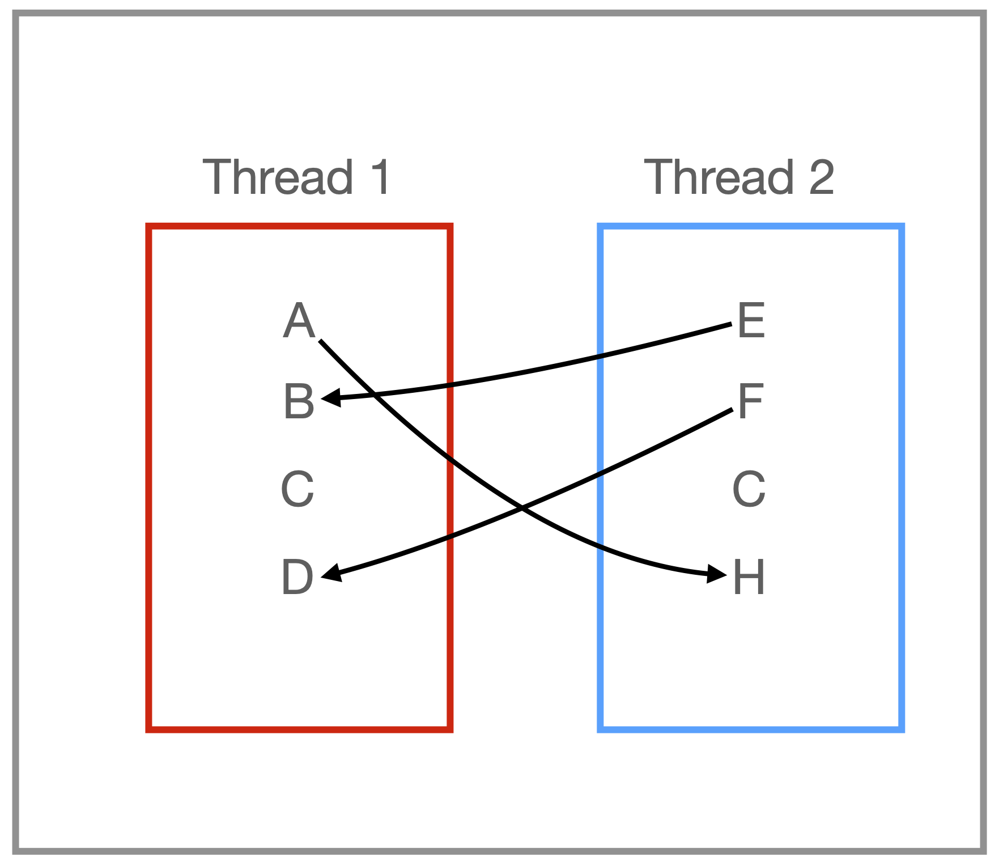

# Serialization-Exercise

This demo does not work on mac OS X. The demo uses unnamed semaphores, which are no longer supported by OS X. It seems to run fine on linux. 

## Description

Adapt the starter code `demo_serialization.cpp` so that the threads execute while satisfying the following conditions: 

- **Task H depends on Task A** (i.e., Task A must be done prior to Task H).  Solution provided as an example !!!.
- **Task B depends on Task E** (i.e., Task E must be done prior to Task B).
- **Task D depends on Task F** (i.e., Task F must be done prior to Task D).
- **Task C writes/updates a shared data structure/variable**. As a result, the task shouldn't be performed concurrently by the threads. 

The dependencies between tasks are illustrated by the directed arcs in Figure 1. 

**Figure 1**: Dependencies and conditions to be satisfied. The arc linking tasks indicate the contingency, e.g., Task A must be done prior to Task H. 

